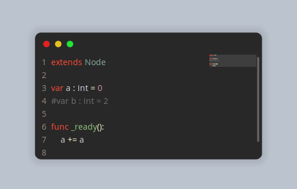

# godot-engine.code-snapshot
A plugin for Godot Engine which will let you take beautified snapshots of your code within the Editor. Configure the frame as you like, with GDScript sintax already highlighted.

### examples
